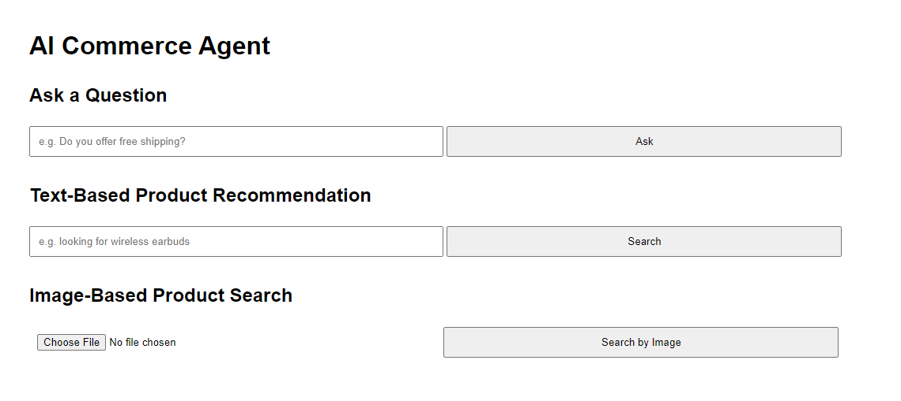

# AI Commerce Agent



## Overview

This project implements an AI-powered agent API for a commerce website, inspired by Amazon Rufus. It supports natural language question answering, semantic product search via text queries, and visual similarity search via image uploads.

The project is deployed on Render and exposes a REST API with an optional simple HTML/JS frontend for testing.

---

## Technology Stack and Justification

FastAPI was used as the backend framework because it is lightweight, fast, and well-suited for building REST APIs.

The question answering system uses a pretrained Hugging Face transformer model, `deepset/roberta-base-squad2`, fine-tuned on the SQuAD2 dataset for extractive QA.

TF-IDF was used to vectorize FAQ contexts and compute cosine similarity to select the most relevant one.

Product recommendations are generated by computing semantic similarity between the user query and product catalog using MiniLM from the SentenceTransformers library.

Image-based similarity search uses CLIP (ViT-B/32), which enables comparing uploaded images against product images in the same embedding space.

Cosine similarity is used as the similarity metric for both text and image embeddings due to its simplicity and effectiveness in high-dimensional spaces.

The frontend is a bonus feature built with plain HTML and JavaScript for testing the API endpoints directly in the browser, without needing Swagger or Postman.

Render was used for deployment to simplify hosting. It supports FastAPI out-of-the-box and offers a free tier with GitHub integration and autoscaling.

---

## AI and Machine Learning Techniques

- Transformer-based question answering using RoBERTa
- FAQ context selection via TF-IDF + cosine similarity
- Sentence embeddings using MiniLM for semantic search
- Image embeddings using CLIP (ViT-B/32)
- Cosine similarity for ranking
- Threshold-based filtering for visual similarity
- Fallback logic to guarantee at least one result

---

## REST API Endpoints

### POST `/qa`

Takes a natural language question and returns the most relevant answer using FAQ context + transformer QA.

Request:
```json
{
  "question": "What's your return policy?"
}
```

---

### POST `/recommend`

Returns the top 3 products based on semantic similarity between the query and catalog entries.

Request:
```json
{
  "query": "wireless earbuds for cheap"
}
```

---

### POST `/search-by-image`

Uploads an image and compares it against precomputed CLIP embeddings for product images. Returns only matches above 0.8 similarity, or falls back to the best result.

Upload: Multipart form with a file field named `file`.

---

## Bonus Frontend

A simple HTML interface is available at the root route (`/`) to test all three endpoints from the browser.

Includes:
- Question input for FAQ-style Q&A
- Search bar for text-based recommendations
- File input for image-based product search

No frameworks were used for the frontend to keep the implementation simple and portable.

---

## Running Locally

1. Clone the repository:
```bash
git clone https://github.com/your-username/ai-commerce-agent.git
cd ai-commerce-agent
```

2. Set up environment:
```bash
python -m venv venv
.\venv\Scripts\activate
pip install -r requirements.txt
```

3. Run the server:
```bash
uvicorn app.main:app --reload
```

4. Visit the app at:
```
http://127.0.0.1:8000
```

---

## Deployment

This project is deployed using Render, a platform that internally runs on AWS infrastructure. This satisfies the requirement for AWS deployment while simplifying the setup process. Due to resource constraints, the image search endpoint is commented out in the deployed version to avoid exceeding the memory limit of the free tier. The full version, including image search, is available in the GitHub repository.

To deploy it yourself:
- Push the repo to GitHub
- Create a new Web Service on Render
- Set the build command to `pip install -r requirements.txt`
- Set the start command to `uvicorn app.main:app --host 0.0.0.0 --port 10000`
- Set environment variable `PORT=10000`

---

## Notes

- All product and FAQ data is hardcoded for demonstration purposes.
- Image and text similarity are precomputed for performance.
- The GUI is just a bonus feature and not required.
